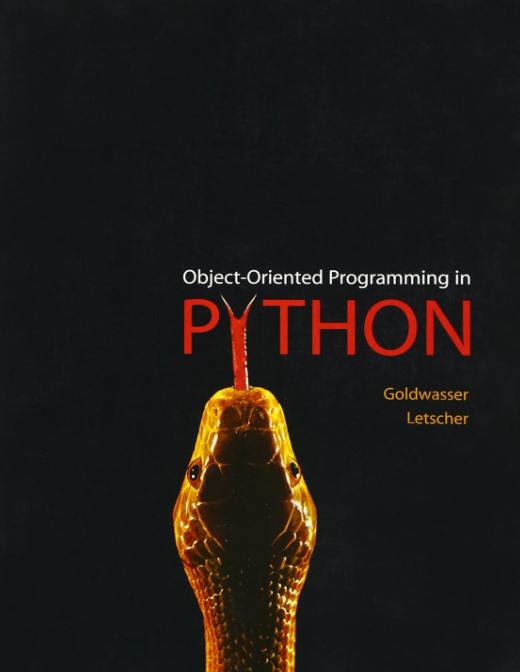

# Object-Oriented-Programming-in-Python

I wanted to make a repository where I solved the end-of-chapter exercises from the "Object Oriented Programming in Python" book.

- New and used print copies of the book can be ordered online through vendors such as [Amazon.com](http://www.amazon.com/Object-Oriented-Programming-Python-Michael-Goldwasser/dp/0136150314)

- Information about the cs1graphics module can be found at www.cs1graphics.org

- [cs1graphics.py](https://cs.slu.edu/~goldwasser/courses/slu/csci150/2006_Fall/doc/cs1graphics.html) documentation.